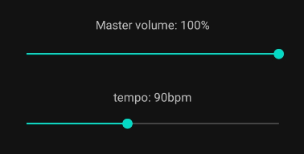
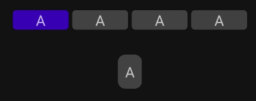
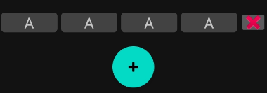
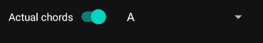
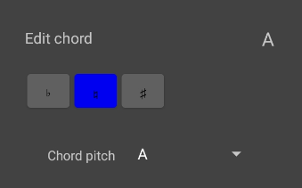
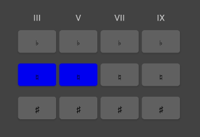

# Tiny Music app

This is an app to play live backing tracks to play along to.

## Building and installation

This is a gradle android project written in kotlin. You will need to install Android studio and 
setup your build environment. Then, you can install the app on your phone.

## APK build: TODO

## Usage

Important note: To hear anything, make sure you have started the song on the play tab,
added at least one instrument which plays at least one note per measure and isn't muted
and have at least one line inserted into your song.

### The play view

This is the default view. Here, you can start or stop playing.

#### Beat indicator

This shows you which beat is currently played.

#### Volume and speed controls

Adjust your volume between 0% and 100%. This will apply to all instruments.

The tempo is adjusted in beats per minute (BPM).

#### Chord preview

Here, you can see which chords will be played next. Underneath the current line, you can also see
a preview of the first chord in the next line to be prepared.

#### Song navigation

For all song navigation, the song will not change its current beat. This means that if you 

Use the simple fast-forward buttons to skip to the next measure and advance to the next chord.

The skip-to end and beginning buttons will skip to the next or previous line of chords.

### The song view

In the song view, you can edit the chords that will be played in your song. After finishing the 
chord progression, the song will start from the beginning once again.

Use the (+) Button to add a new line to the song. All chords in the new line will be the (I) chord.

Use the (x) Button next to a line to purge it from the song.

#### Absolute vs. relative notation

The song view supports two different notation views. You can change the key of the song at any time.

By default, normal chord names are displayed. Turning this option off allows you to see the chords
written in roman numerals, without any reference to a specific key.

#### Chord editing

After clicking on one chord, you will open a modal window to edit one chord.

The chord pitch selects which degree the chord will be. You can also shift the degree of the chord
up or down one semitone with the top selector. Keep in mind that the accidentals in this view are
always in reference to your selected key, meaning that in G major, a F# will be selected as the 7th
degree without an accidental, while F flat will be the 7th degree with a flat in front.

You can also modify the other chord notes which will be referenced in relation to your root note.
A chord must always contain a 3rd and 5th degree and can optionally have 7th and 9th degrees.
All of the degrees can be modified flat or sharp and will influence the notated chord.

Sometimes, the function of a note can change when pitched up or down. For example, a flat 7th degree
will become the added 6th of the chord.