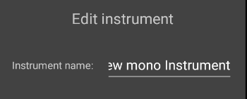

# Tiny Music app

This is an app to play live backing tracks to play along to.

## Building and installation

This is a gradle android project written in kotlin. You will need to install Android studio and 
setup your build environment. Then, you can install the app on your phone.

## APK build: TODO

## Usage

Important note: To hear anything, make sure you have started the song on the play tab,
added at least one instrument which plays at least one note per measure and isn't muted
and have at least one line inserted into your song.

### The play view

This is the default view. Here, you can start or stop playing.

#### Beat indicator

This shows you which beat is currently played.

#### Volume and speed controls

Adjust your volume between 0% and 100%. This will apply to all instruments.

The tempo is adjusted in beats per minute (BPM).

#### Chord preview

Here, you can see which chords will be played next. Underneath the current line, you can also see
a preview of the first chord in the next line to be prepared.

#### Song navigation

For all song navigation, the song will not change its current beat. This means that if you 

Use the simple fast-forward buttons to skip to the next measure and advance to the next chord.

The skip-to end and beginning buttons will skip to the next or previous line of chords.

### The song view

In the song view, you can edit the chords that will be played in your song. After finishing the 
chord progression, the song will start from the beginning once again.

Use the (+) Button to add a new line to the song. All chords in the new line will be the (I) chord.

Use the (x) Button next to a line to purge it from the song.

#### Absolute vs. relative notation

The song view supports two different notation views. You can change the key of the song at any time.

By default, normal chord names are displayed. Turning this option off allows you to see the chords
written in roman numerals, without any reference to a specific key.

#### Chord editing

After clicking on one chord, you will open a modal window to edit one chord.

The chord pitch selects which degree the chord will be. You can also shift the degree of the chord
up or down one semitone with the top selector. Keep in mind that the accidentals in this view are
always in reference to your selected key, meaning that in G major, a F# will be selected as the 7th
degree without an accidental, while F flat will be the 7th degree with a flat in front.

You can also modify the other chord notes which will be referenced in relation to your root note.
A chord must always contain a 3rd and 5th degree and can optionally have 7th and 9th degrees.
All of the degrees can be modified flat or sharp and will influence the notated chord.

Sometimes, the function of a note can change when pitched up or down. For example, a flat 7th degree
will become the added 6th of the chord.

### The Instruments view

In the instruments tab, you can configure the instruments that play.

Use the button in the bottom-right corner of your screen to add a new instrument.

Mono instruments can only play one note, while poly instruments can play up to five notes
at a time.

You can remove an instrument from the list using the trash icon.

The (M) button will mute an instrument. If it is red, the instrument will no longer be playing any
more music.

The (S) button will solo an instrument. If it is blue, only sound from this instrument will be played.
This mode can be used to inspect and "debug" just one voice at a time.

#### The instrument editor

Use the pencil icon on a instrument to open its settings window.

Near the top, there is a text field where a name can be given to an instrument to easily distinguish
it amongst all other instruments.

You can select between 4 different base oscillator waveforms: sine, sawtooth, square and triangle.

The volume slider changes the volume of just this instrument and is applied after all effects.

##### Instrument voicing

There are 5 different voicing types:

- Chord root note: play the root note of the chord
- Chord notes: play notes from the current chord
- Scale notes: play notes from a major scale relative to the current chord's root note
- Root note: only play the song's key note
- Song root relative: play chromatic notes always relative to the song's key

Pressing the pencil button will show you the instrument voicing window:

You can select the octave of the voice to transpose it by up to 4 octaves up or down.

If restriking is enabled (the restrike button is green), notes will be played again when a new (sub)-
beat is reached (The envelope is triggered again). If it is off, a note will be held for longer if 
multiple active notes connect on the grid.

One button in the grid represents one note. The vertical axis is the tone pitch and selects from
the notes provided by the voicing type. On the horizontal axis is time. The main beats are 
colored differently to allow for easy navigation.

#### Envelope settings

The envelope settings allow you to select an attack time, delay time, sustain level and release time.

Times are configurable between 5ms and 200ms.

Tip: Use a sustain level of 0% to emulate a plucked or struck instrument.

#### Effects settings

There are currently 3 effects implemented:

- Low pass filter: remove high frequencies. This filter tracks along with the played note to provide a consistent timbre through all notes.
- Noise: This filter mixes the input signal with white noise.
- Distortion: Scale up and clip the signal back to a valid range.

Each effect can be turned on or off. By default, all effects are turned off.

There is also an "influence" setting for each effect. After calculating the signal after the effect,
The resulting signal is interpolated with the input signal using the influence setting. This allows effects to be partially faded out.

By holding on and dragging an effect, the order of the effects can be manipulated to suit the user's needs.