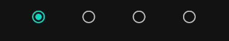

# Tiny Music app

This is an app to play live backing tracks to play along to.

## Building and installation

This is a gradle android project written in kotlin. You will need to install Android studio and 
setup your build environment. Then, you can install the app on your phone.

## APK build: TODO

## Usage

Important note: To hear anything, make sure you have started the song on the play tab,
added at least one instrument which plays at least one note per measure and isn't muted
and have at least one line inserted into your song.

### The play view

This is the default view. Here, you can start or stop playing.

#### Beat indicator

This shows you which beat is currently played.

#### Volume and speed controls

Adjust your volume between 0% and 100%. This will apply to all instruments.

The tempo is adjusted in beats per minute (BPM).

#### Chord preview

Here, you can see which chords will be played next. Underneath the current line, you can also see
a preview of the first chord in the next line to be prepared.

#### Song navigation

For all song navigation, the song will not change its current beat. This means that if you 

Use the simple fast-forward buttons to skip to the next measure and advance to the next chord.

The skip-to end and beginning buttons will skip to the next or previous line of chords.